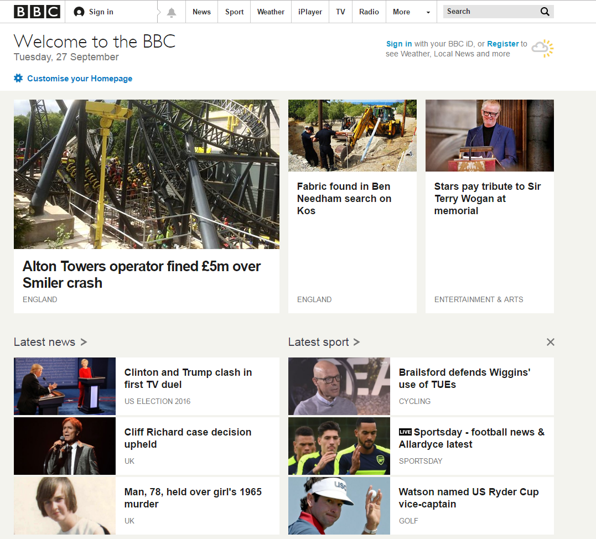

# Responsive Experiment

 

##BBC News Homepage

Below is an example of responsive design in action on the  [BBC News website](https://www.bbc.co.uk/)

- As the screen size decreases the layout of the new stories changes depending on screen size. 
- The horizontal menu bar shrinks to fit the new screen resolution. 

 

##Youtube Homepage

Below is an example of responsive design in action on the  [Youtube Homepage](https://www.youtube.com/)

- As the screen resolution, youtube puts more focus on the actual websites content and removes all unnecessary options. 
- The menu bar moves from the left hand side to top centre and consists of viewer options on smaller resolution devices.

 

##Twitch.tv Homepage

Below is an example of responsive design in action on the  [Twitch Homepage](https://www.twitch.tv/)

- As the screen size decreases the adverts that are taking up alot of the desktop browsers view is reducded dependant of the new screen size. 
